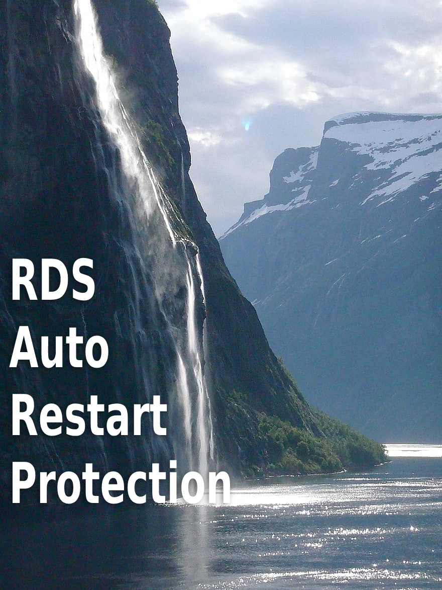
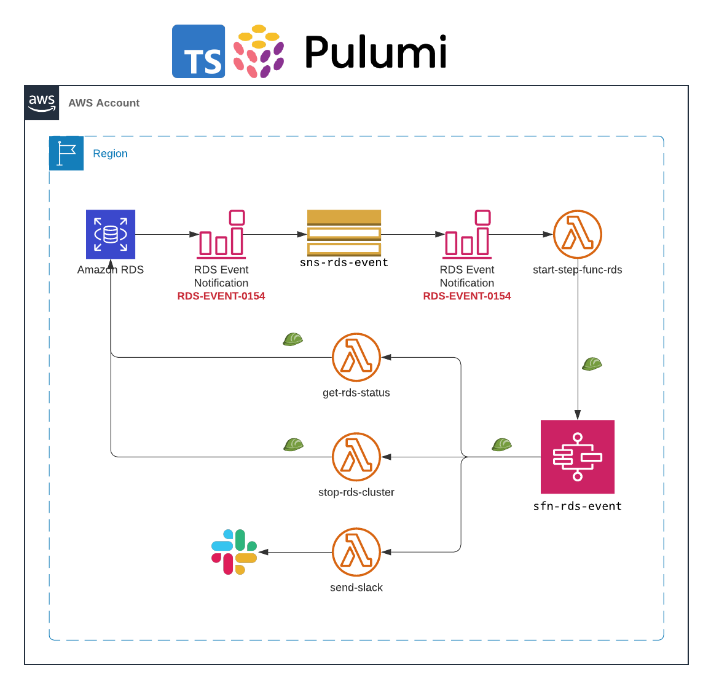
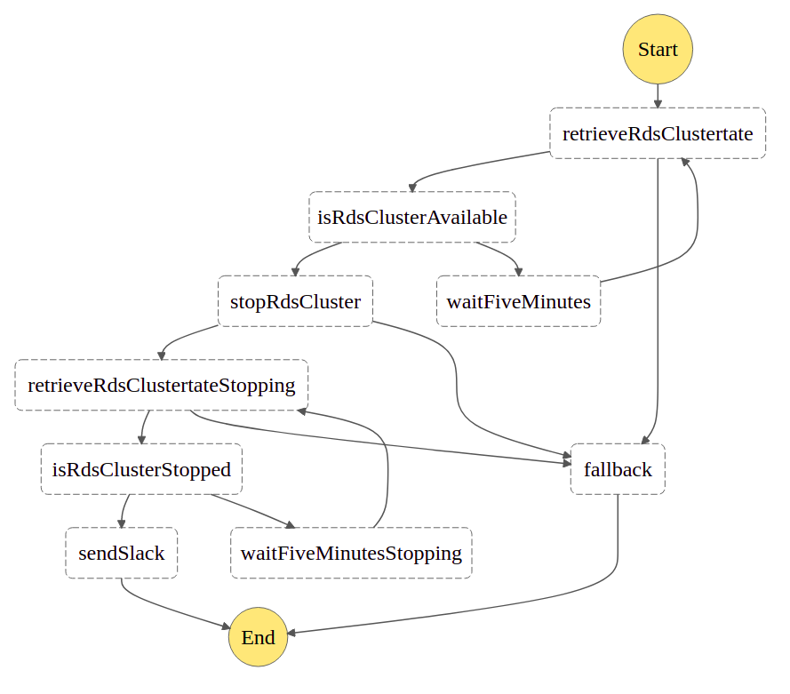
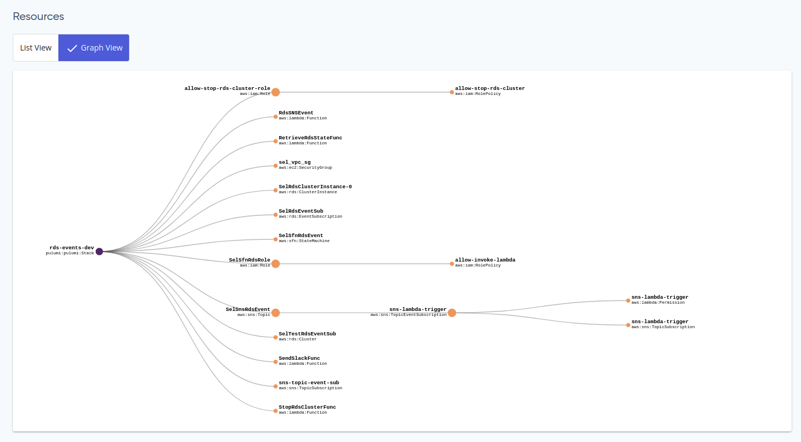

<p align="center">
  <a href="https://dev.to/vumdao">
    
  </a>
</p>
<h1 align="center">
  <div><b>RDS Auto Restart Protection</b></div>
</h1>

## Abstract
- Customers needing to keep an Amazon Relational Database Service (Amazon RDS) instance stopped for more than 7 days, look for ways to efficiently re-stop the database after being [automatically started by Amazon RDS](https://docs.aws.amazon.com/AmazonRDS/latest/UserGuide/USER_StopInstance.html). If the database is started and there is no mechanism to stop it; customers start to pay for the instance’s hourly cost

- Stopping and starting a DB instance is faster than creating a DB snapshot, and then restoring the snapshot.

- This blog provides a step-by-step approach to automatically stop an RDS cluster with fully serverless and using Pulumi to create AWS resources

## Table Of Contents
 * [Overview of Pulumi](#Overview-of-Pulumi)
 * [Solution overview](#Solution-overview)
 * [Create RDS cluster with multiple instances](#Create-RDS-cluster-with-multiple-instances)
 * [Create SNS topic and subscribe event to the RDS cluster](#Create-SNS-topic-and-subscribe-event-to-the-RDS-cluster)
 * [Create Lambda function which is subscribe to the SNS topic](#Create-Lambda-function-which-is-subscribe-to-the-SNS-topic)
 * [Create lambda function to retrieve RDS cluster and instances status](#Create-lambda-function-to-retrieve-RDS-cluster-and-instances-status)
 * [Create lambda function to stop RDS cluster](#Create-lambda-function-to-stop-RDS-cluster)
 * [Create lambda function to send slack](#Create-lambda-function-to-send-slack)
 * [SFN IAM role to trigger lambda functions](#SFN-IAM-role-to-trigger-lambda-functions)
 * [Pulumi deploy stack](#Pulumi-deploy-stack)
 * [Conclusion](#Conclusion)

---

## 🚀 **Overview of Pulumi** <a name="Overview-of-Pulumi"></a>
- [Why Pulumi?](https://www.pulumi.com/why-pulumi/) Pulumi enables developers to write infrastructure as code in their favorite languages, such as TypeScript, JavaScript, Python, and Go.

- Here is general steps-by-step to create pulumi project and its stack

1. Create new project
```
pulumi new aws-typescript
```

2. Set up aws profile
- When create/init a stack `pulumi stack init` the `Pulumi.<stack-name>.yaml` is not created so we have to set config ourselves
```
pulumi config set aws:region ap-northeast-2
pulumi config set aws:profile myprofile
```

3. Pulumi bash completion
- Feel lazy for typing? Setup bashcompletion for pulumi

```
pulumi gen-completion bash > /etc/bash_completion.d/pulumi
```

- Update `.bashrc` for alias
```
# add Pulumi to the PATH
export PATH=$PATH:$HOME/.pulumi/bin
alias plm='/home/vudao/.pulumi/bin/pulumi'
complete -F __start_pulumi plm
```

4. Import existing resources
- For creating new RDS cluster to test the flow, we can import existing Security group or anything to the stack

```
pulumi import aws:ec2/securityGroup:SecurityGroup vpc_sg sg-13a02c7a
```

5. Refresh the stack
-  If we manually delete the resources which are managed by the stack we can run refresh to update stack resource status
```
pulumi refresh
```

## 🚀 **Solution overview** <a name="Solution-overview"></a>



- The solution relies on RDS event notifications. Once a stopped RDS instance is started by AWS due to exceeding the maximum time in the stopped state; an event (RDS-EVENT-0154) is generated by RDS.
- The RDS event is pushed to a dedicated SNS topic `sns-rds-event`.
- The Lambda function `start-step-func-rds` is subscribed to the SNS topic `sns-rds-event`
  - The function filters messages with [event code](https://docs.aws.amazon.com/AmazonRDS/latest/AuroraUserGuide/USER_Events.Messages.html#USER_Events.Messages.cluster): `RDS-EVENT-0153` (The DB cluster is being started due to it exceeding the maximum allowed time being stopped.), plus the function validates that the RDS instance is tagged with `auto-restart-protection` and that the tag value is set to `yes`.
  - Once all conditions are met, the Lambda function starts the AWS Step Functions state machine execution.
- The AWS Step Functions state machine integrates with two Lambda functions in order to retrieve the instance state, as well as attempt to stop the RDS instance.
  - In case the instance state is not ‘available’, the state machine waits for 5 minutes and then re-checks the state.
  - Finally, when the Amazon RDS instance state is ‘available’; the state machine will attempt to stop the Amazon RDS instance.
- Note: This blog is for handling RDS cluster with multiple intances, for single instance, catch [`RDS-EVENT-0154`](https://docs.aws.amazon.com/AmazonRDS/latest/UserGuide/USER_Events.Messages.html): The DB instance is being started due to it exceeding the maximum allowed time being stopped.

---

# **Let's start writing IaC using Pulumi and typescript**

## 🚀 **Create RDS cluster with multiple instances** <a name="Create-RDS-cluster-with-multiple-instances"></a>
- Create RDS cluster with one or more instances
- Using the imported existing VPC (optional)

<details>
<summary>rds.ts</summary>

```
import * as aws from "@pulumi/aws";

const vpc_sg = new aws.ec2.SecurityGroup("vpc_sg",
    {
        description: "Allows inbound and outbound traffic for all instances in the VPC",
        name: "vpc-sec",
        revokeRulesOnDelete: false,
        tags: {
            Name: "vpc-sec",
        }
    },
    {
        protect: true,
    }
);

export const rds_cluster = new aws.rds.Cluster('SelTestRdsEventSub', {
    //availabilityZones: ['ap-northeast-2a', 'ap-northeast-2c'],
    clusterIdentifier: 'my-test-rds-sub',
    engine: 'aurora-postgresql',
    masterUsername: 'postgres',
    masterPassword: '*****',
    dbSubnetGroupName: 'aws-test',
    databaseName: "mydb",
    skipFinalSnapshot: true,
    vpcSecurityGroupIds: [vpc_sg.id],
    tags: {
        'Name': 'my-test-rds-sub',
        'stack': 'pulumi-rds',
        'auto-restart-protection': 'yes'
    }
});

export const clusterInstances: aws.rds.ClusterInstance[] = [];

for (const range = {value: 0}; range.value < 1; range.value++) {
    clusterInstances.push(new aws.rds.ClusterInstance(`SelRdsClusterInstance-${range.value}`, {
        identifier: `my-test-rds-sub-${range.value}`,
        clusterIdentifier: rds_cluster.id,
        instanceClass: aws.rds.InstanceType.T3_Medium,
        engine: 'aurora-postgresql',
        engineVersion: rds_cluster.engineVersion,
        dbSubnetGroupName: 'aws-test',
        tags: {
            'Name': `my-test-rds-sub-${range.value}`,
            'stack': 'pulumi-rds-instance',
            'auto-restart-protection': 'yes'
        }
    }))
}
```

</details>

## 🚀 **Create SNS topic and subscribe event to the RDS cluster** <a name="Create-SNS-topic-and-subscribe-event-to-the-RDS-cluster"></a>
- Create a SNS topic to receive events from RDS cluster
- Create event subscription:
  - Target: the SNS topic
  - Source Type: Clusters (and point to the cluster which created from above step)
  - Specific event categories: `notification`

<details>
<summary>index.ts</summary>

```
import * as aws from "@pulumi/aws";
import { state_machine_handler } from "./stepFunc";
import { rds_cluster } from "./rds";


const sns_rds_event = new aws.sns.Topic('SnsRdsEvent', {
    displayName: 'sns-rds-event',
    name: 'sns-rds-event',
    tags: {
        'Name': 'sns-rds-event',
        'stack': 'plumi-sns'
    }
});

const rds_event_sub = new aws.rds.EventSubscription('RdsEventSub', {
    enabled: true,
    name: 'rds-event-sub',
    eventCategories: ['notification'],
    sourceType: 'db-cluster',
    sourceIds: [rds_cluster.id],
    snsTopic: sns_rds_event.arn,
    tags: {
        'Name': 'rds-event-sub',
        'stack': 'pulumi-event'
    }
});

const sns_sub = new aws.sns.TopicSubscription('sns-topic-event-sub', {
    endpoint: state_machine_handler.arn,
    protocol: 'lambda',
    topic: sns_rds_event.arn
});

sns_rds_event.onEvent('sns-lambda-trigger', state_machine_handler, sns_sub)
```

</details>

## 🚀 **Create Lambda function which is subscribe to the SNS topic** <a name="Create-Lambda-function-which-is-subscribe-to-the-SNS-topic"></a>
- The lambda function will be triggerd by SNS topic whenever there's event
- The lambda function parses the event message to filter event ID `RDS-EVENT-0153` and checks the RDS cluster tag for key:value `auto-restart-protection: yes`. If all conditions match, then the lambda function execute Step Functions state machine

- Create IAM role which is consumed by lambda function

<details>
<summary>iam-role</summary>

```
export const allowRdsClusterRole = new aws.iam.Role("allow-stop-rds-cluster-role", {
    name: 'lambda-stop-rds-cluster',
    description: 'Role to stop rds cluster base on event',
    assumeRolePolicy: JSON.stringify({
        Version: "2012-10-17",
        Statement: [{
            Action: "sts:AssumeRole",
            Effect: "Allow",
            Sid: "",
            Principal: {
                Service: "lambda.amazonaws.com",
            },
        }],
    }),
    tags: {
        'Name': 'lambda-stop-rds-cluster',
        'stack': 'pulumi-iam'
    },
});

const rds_policy = new aws.iam.RolePolicy("allow-stop-rds-cluster", {
    role: allowRdsClusterRole,
    policy: {
        Version: "2012-10-17",
        Statement: [
            {
                Sid: "AllowRdsStatement",
                Effect: "Allow",
                Resource: "*",
                Action: [
                    "rds:AddTagsToResource",
                    "rds:ListTagsForResource",
                    "rds:DescribeDB*",
                    "rds:StopDB*"
                ]
            },
            {
                Sid: "AllowSfnStatement",
                Effect: "Allow",
                Resource: "*",
                Action: "states:StartExecution"
            },
            {
                Sid: 'AllowLog',
                Effect: 'Allow',
                Resource: "arn:aws:logs:*:*:*",
                Action: [
                    "logs:CreateLogGroup",
                    "logs:CreateLogStream",
                    "logs:PutLogEvents"
                ],
            }
        ]
    },
}, {parent: allowRdsClusterRole});
```

</details>

- Create lambda function which is subscription of the SNS topic

<details>
<summary>start-step-func-lambda</summary>

```
export const state_machine_handler = new aws.lambda.Function('RdsSNSEvent',
    {
        code: new pulumi.asset.FileArchive('lambda-code/start-statemachine-execution-lambda/handler.tar.gz'),
        description: 'Lambda function listen to RDS SNS event topic to trigger step function',
        name: 'start-step-func-rds',
        handler: 'app.handler',
        runtime: aws.lambda.Runtime.Python3d8,
        role: handler.allowRdsClusterRole.arn,
        environment: {
            variables: {
                'STEPFUNCTION_ARN': stepFunction.arn
            }
        },
        tags: {
            'Name': 'start-step-func-rds',
            'stack': 'pulumi-lambda'
        }
    },
    {
        dependsOn: [handler.allowRdsClusterRole]
    }
);
```

</details>

- Create step function state machine with flowing definitions



<details>
<summary>stepFunc.ts</summary>

```
import * as aws from '@pulumi/aws';
import * as pulumi from '@pulumi/pulumi';
import * as handler from './handler';


export const stepFunction = new aws.sfn.StateMachine('SfnRdsEvent', {
    name: 'sfn-rds-event',
    roleArn: handler.sfn_role.arn,
    tags: {
        'Name': 'sfn-rds-event',
        'stack': 'pulumi-sfn'
    },
    definition: pulumi.all([handler.retrieve_rds_status_handler.arn, handler.stop_rds_cluster_handler.arn, handler.send_slack_handler.arn])
        .apply(([retrieveArn, stopRdsArn, sendSlackArn]) => {
        return JSON.stringify({
            "Comment": "RdsAutoRestartWorkFlow: Automatically shutting down RDS instance after a forced Auto-Restart",
            "StartAt": "retrieveRdsClustertate",
            "States": {
                "retrieveRdsClustertate": {
                    "Type": "Task",
                    "Resource": retrieveArn,
                    "TimeoutSeconds": 5,
                    "Retry": [
                        {
                        "ErrorEquals": [
                            "Lambda.Unknown",
                            "States.TaskFailed"
                        ],
                        "IntervalSeconds": 3,
                        "MaxAttempts": 2,
                        "BackoffRate": 1.5
                        }
                    ],
                    "Catch": [
                        {
                        "ErrorEquals": [
                            "States.ALL"
                        ],
                        "Next": "fallback"
                        }
                    ],
                    "Next": "isRdsClusterAvailable"
                },
                "isRdsClusterAvailable": {
                    "Type": "Choice",
                    "Choices": [
                        {
                        "Variable": "$.readyToStop",
                        "StringEquals": "yes",
                        "Next": "stopRdsCluster"
                        }
                    ],
                    "Default": "waitFiveMinutes"
                },
                "waitFiveMinutes": {
                    "Type": "Wait",
                    "Seconds": 300,
                    "Next": "retrieveRdsClustertate"
                },
                "stopRdsCluster": {
                    "Type": "Task",
                    "Resource": stopRdsArn,
                    "TimeoutSeconds": 5,
                    "Retry": [
                        {
                        "ErrorEquals": [
                            "States.Timeout"
                        ],
                        "IntervalSeconds": 3,
                        "MaxAttempts": 2,
                        "BackoffRate": 1.5
                        }
                    ],
                    "Catch": [
                        {
                        "ErrorEquals": [
                            "States.ALL"
                        ],
                        "Next": "fallback"
                        }
                    ],
                    "Next": "retrieveRdsClustertateStopping"
                },
                "retrieveRdsClustertateStopping": {
                    "Type": "Task",
                    "Resource": retrieveArn,
                    "TimeoutSeconds": 5,
                    "Retry": [
                        {
                        "ErrorEquals": [
                            "States.Timeout"
                        ],
                        "IntervalSeconds": 3,
                        "MaxAttempts": 2,
                        "BackoffRate": 1.5
                        }
                    ],
                    "Catch": [
                        {
                        "ErrorEquals": [
                            "States.ALL"
                        ],
                        "Next": "fallback"
                        }
                    ],
                    "Next": "isRdsClusterStopped"
                },
                "isRdsClusterStopped": {
                    "Type": "Choice",
                    "Choices": [
                        {
                        "Variable": "$.rdsClusterStatus",
                        "StringEquals": "stopped",
                        "Next": "sendSlack"
                        }
                    ],
                    "Default": "waitFiveMinutesStopping"
                },
                "waitFiveMinutesStopping": {
                    "Type": "Wait",
                    "Seconds": 300,
                    "Next": "retrieveRdsClustertateStopping"
                },
                "sendSlack": {
                    "Type": "Task",
                    "Resource": sendSlackArn,
                    "TimeoutSeconds": 5,
                    "End": true
                },
                "fallback": {
                    "Type": "Task",
                    "Resource": sendSlackArn,
                    "TimeoutSeconds": 5,
                    "End": true
                }
            }
        });
    })
});
```

</details>

## 🚀 **Create lambda function to retrieve RDS cluster and instances status** <a name="Create-lambda-function-to-retrieve-RDS-cluster-and-instances-status"></a>

<details>
<summary>retrieve-rds-status.ts</summary>

```
export const retrieve_rds_status_handler = new aws.lambda.Function('RetrieveRdsStateFunc', {
    code: new pulumi.asset.FileArchive('lambda-code/retrieve-rds-instance-state-lambda/handler.tar.gz'),
    description: 'Lambda function to retrieve rds instance status',
        name: 'get-rds-status',
        handler: 'app.handler',
        runtime: aws.lambda.Runtime.Python3d8,
        role: allowRdsClusterRole.arn,
        tags: {
            'Name': 'get-rds-status',
            'stack': 'pulumi-lambda'
        }
});
```

</details>

## 🚀 **Create lambda function to stop RDS cluster** <a name="Create-lambda-function-to-stop-RDS-cluster"></a>

<details>
<summary>stop-rds.ts</summary>

```
export const stop_rds_cluster_handler = new aws.lambda.Function('StopRdsClusterFunc', {
    code: new pulumi.asset.FileArchive('lambda-code/stop-rds-instance-lambda/handler.tar.gz'),
    description: 'Lambda function to retrieve rds instance status',
        name: 'stop-rds-cluster',
        handler: 'app.handler',
        runtime: aws.lambda.Runtime.Python3d8,
        role: allowRdsClusterRole.arn,
        tags: {
            'Name': 'stop-rds-cluster',
            'stack': 'pulumi-lambda'
        }
});
```

</details>

## 🚀 **Create lambda function to send slack** <a name="Create-lambda-function-to-send-slack"></a>

<details>
<summary>send-slack.ts</summary>

```
export const send_slack_handler = new aws.lambda.Function('SendSlackFunc', {
    code: new pulumi.asset.FileArchive('lambda-code/send-slack/handler.tar.gz'),
    description: 'Lambda function to send slack',
        name: 'rds-send-slack',
        handler: 'app.handler',
        runtime: aws.lambda.Runtime.Python3d8,
        role: allowRdsClusterRole.arn,
        tags: {
            'Name': 'rds-send-slack',
            'stack': 'pulumi-lambda'
        }
});
```

</details>

## 🚀 **SFN IAM role to trigger lambda functions** <a name="SFN-IAM-role-to-trigger-lambda-functions"></a>

<details>
<summary>sfn-role.ts</summary>

```
export const sfn_role = new aws.iam.Role('SfnRdsRole', {
    name: 'sfn-rds',
    description: 'Role to trigger lambda functions',
    assumeRolePolicy: JSON.stringify({
        Version: "2012-10-17",
        Statement: [{
            Action: "sts:AssumeRole",
            Effect: "Allow",
            Sid: "",
            Principal: {
                Service: "states.ap-northeast-2.amazonaws.com",
            },
        }],
    }),
    tags: {
        'Name': 'sfn-rds',
        'stack': 'pulumi-iam'
    }
});
```

</details>

## 🚀 **Pulumi deploy stack** <a name="Pulumi-deploy-stack"></a>



## 🚀 **Conclusion** <a name="Conclusion"></a>
- We now can save time and save money with this solution. Plus, we will receive slack message when there're events

- Although Pulumi Supports Many Clouds and provisioner and can visulize the resources chart within the stack but there're more options such as AWS Cloud Development Kit (CDK)

---

Ref: [Field Notes: Stopping an Automatically Started Database Instance with Amazon RDS](https://aws.amazon.com/blogs/architecture/field-notes-stopping-an-automatically-started-database-instance-with-amazon-rds/)


<h3 align="center">
  <a href="https://dev.to/vumdao">:stars: Blog</a>
  <span> · </span>
  <a href="https://github.com/vumdao/clickhouse-troubleshooting/">Github</a>
  <span> · </span>
  <a href="https://stackoverflow.com/users/11430272/vumdao">stackoverflow</a>
  <span> · </span>
  <a href="https://www.linkedin.com/in/vu-dao-9280ab43/">Linkedin</a>
  <span> · </span>
  <a href="https://www.linkedin.com/groups/12488649/">Group</a>
  <span> · </span>
  <a href="https://www.facebook.com/CloudOpz-104917804863956">Page</a>
  <span> · </span>
  <a href="https://twitter.com/VuDao81124667">Twitter :stars:</a>
</h3>
